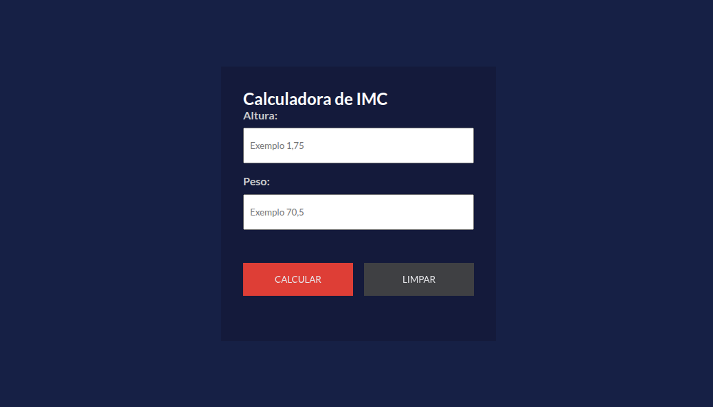

# Calculadora de IMC



## Descrição

Aplicação web para cálculo de **IMC (Índice de Massa Corporal)**, desenvolvida com HTML, CSS e JavaScript puro.

O projeto permite:

- Inserir altura e peso com máscara de entrada no padrão brasileiro (vírgula decimal);
- Calcular o IMC com 1 casa decimal;
- Exibir a situação atual do usuário com destaque visual por nível;
- Apresentar tabela completa de classificação do IMC;
- Limpar os campos e refazer o cálculo de forma rápida.

### Regras de classificação utilizadas

| Faixa de IMC | Classificação | Grau de obesidade |
|---|---|---|
| Menor que 18,5 | Magreza | 0 |
| Entre 18,5 e 24,9 | Normal | 0 |
| Entre 25,0 e 29,9 | Sobrepeso | I |
| Entre 30,0 e 39,9 | Obesidade | II |
| Maior que 40,0 | Obesidade grave | III |

## Tecnologias e Dependências

- **HTML5** para estrutura da interface;
- **CSS3** para estilização e layout responsivo básico;
- **JavaScript (Vanilla)** para lógica de cálculo, máscara de inputs e manipulação do DOM;
- **Google Fonts (Lato)** para tipografia.

> Não há dependências de build, framework ou pacote externo via npm.

## Instalação

Siga os passos abaixo para executar localmente:

1. Clone o repositório:

```bash
git clone https://github.com/kevenklynsman/Calculadora-IMC.git
```

2. Acesse a pasta do projeto:

```bash
cd Calculadora-IMC
```

3. Execute a aplicação (escolha uma opção):

- **Opção A (recomendada):** use a extensão **Live Server** no VS Code e abra o `index.html`;
- **Opção B:** abra o arquivo `index.html` diretamente no navegador.

## Pré-requisitos

- Navegador moderno (Google Chrome, Microsoft Edge ou Firefox);
- VS Code (opcional, para desenvolvimento);
- Extensão **Live Server** (opcional, recomendada para execução local).

## Imagens


## Contato

- GitHub: [kevenklynsman](https://github.com/kevenklynsman)
- LinkedIn: [kevenklynsman](https://www.linkedin.com/in/kevenklynsman/)
- E-mail: [kevenklynsman2003@gmail.com](mailto:kevenklynsman2003@gmail.com)